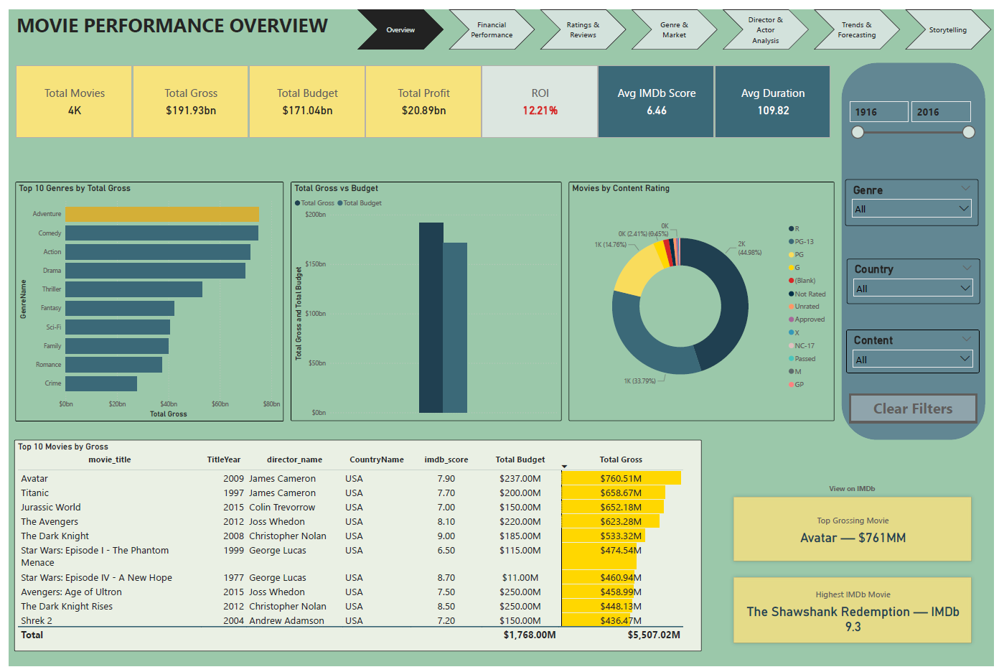

# 🎬 IMDb Movie Data Analysis — Power BI Dashboard

## 📘 Overview
This Power BI dashboard analyzes IMDb movie data to uncover patterns in financial performance, ratings, genres, and key contributors.  
The goal is to understand what drives movie success and how industry trends evolved over nearly a century.

---

## 📏 Metrics Snapshot
- **Movies Analyzed:** 4,000+  
- **Avg IMDb Score:** 6.46  
- **Total Gross Revenue:** $191.9B  
- **Total Budget:** $171.0B  
- **Total Profit:** $20.9B  
- **Avg Runtime:** 109 minutes  

---

## ✨ Dashboard Features
- Genre performance by revenue, ratings, and ROI  
- Top directors, actors, and their contribution to box office success  
- Budget, gross, and IMDb score trends across decades  
- Country-level earnings contribution  
- Profitability and ROI analysis  

---

## 📈 Analytical Insights
- **Adventure, Action, and Comedy** lead global box office revenue  
- **Film-Noir and Documentary** deliver the highest average IMDb scores and ROI  
- **High budgets do not strongly predict higher IMDb ratings**  
- **USA dominates global revenue contributions**  
- Consistent top performers include **Spielberg, Cameron, and Nolan**  

---

## 🧠 What I Learned
- Building multi-page, insight-driven dashboards  
- Creating calculated fields and profitability metrics using **DAX**  
- Structuring raw datasets for clean **Power BI data models**  
- Identifying relationships between ratings, budget, and audience reception  
- Presenting insights clearly through well-structured visuals  

---

## 🖼️ Dashboard Snapshot

