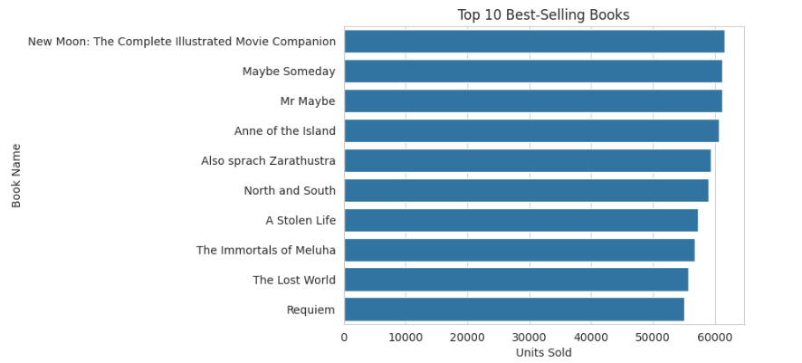
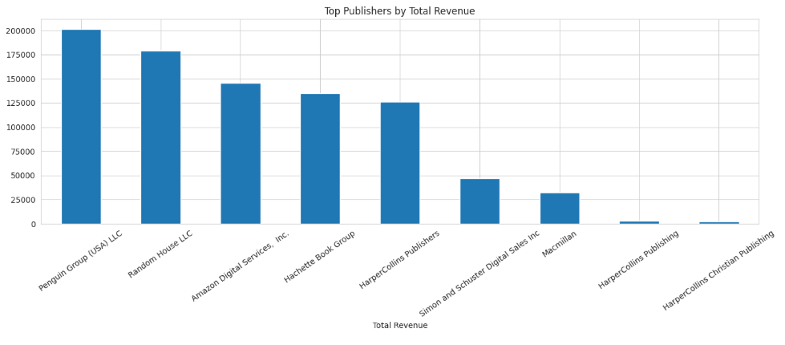
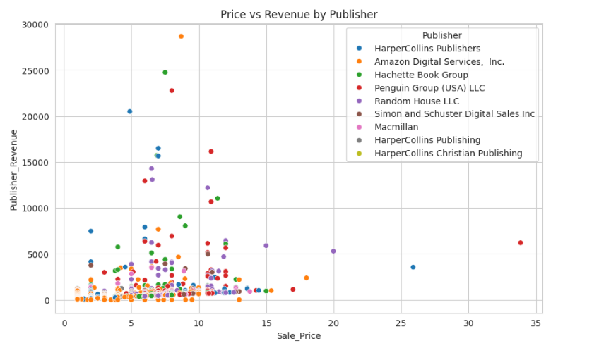

<h1>📚 Book Publishing Sales Analysis</h1>

A data-driven exploration of how publishers, authors, prices, and ratings shape book sales.  
This project uses <strong>Python</strong>, <strong>Pandas</strong>, <strong>Seaborn</strong>, and <strong>Jupyter Notebook</strong> to clean the data, analyze trends, and visualize key insights in the publishing industry.

   
  <em style="font-size: 12px;">A library associated with James Joyce, surrounded by readers and books.</em>

<h2> Project Overview</h2>

The analysis focuses on understanding what drives book performance by examining:

<ul>
  <li><strong>Sales patterns</strong> — top-selling books and the role of pricing</li>
  <li><strong>Publisher performance</strong> — which publishers dominate sales and revenue</li>
  <li><strong>Ratings</strong> — whether highly-rated books sell more</li>
  <li><strong>Genres</strong> — how different genres vary in sales and pricing</li>
  <li><strong>Authors</strong> — author frequency and contribution patterns</li>
</ul>

<h2> Data Cleaning</h2>

Key preprocessing steps included:

<ul>
  <li>Handling missing values and duplicates</li>
  <li>Fixing invalid years and converting datatypes</li>
  <li>Separating authors into a relational author table</li>
  <li>Creating a unique <code>Book_ID</code> for linking</li>
</ul>

<h2> Exploratory Data Analysis</h2>

Several visualizations and statistical summaries were created, covering:

<ul>
  <li>Univariate distributions (sales, ratings, publishing year)</li>
  <li>Bivariate relationships (price vs sales, rating vs sales)</li>
  <li>Multivariate patterns involving price, rating, genre, and revenue</li>
  <li>Correlation heatmaps of numeric fields</li>
  <li>Author-level frequency analysis</li>
</ul>

<h2> Key Insights</h2>
<ul>
  <li>A small number of books and publishers account for most sales</li>
  <li>Ratings help, but price and genre also strongly influence performance</li>
  <li>Genres differ widely in both sales potential and pricing strategy</li>
  <li>Sales success is usually shaped by a combination of factors, not just one</li>
</ul>

<h2> Conclusion</h2>

The analysis provides a clear understanding of the major forces behind book sales and offers a solid foundation for future work, such as building predictive models or deeper publisher/genre-level studies.

<h2> Screenshots</h2>

Below are a few sample visuals from the analysis.  
These charts highlight some of the patterns uncovered during the exploratory phase, 
including the books with the highest sales, the publishers earning the most revenue, 
and how price relates to revenue across the dataset.

    
    
  

